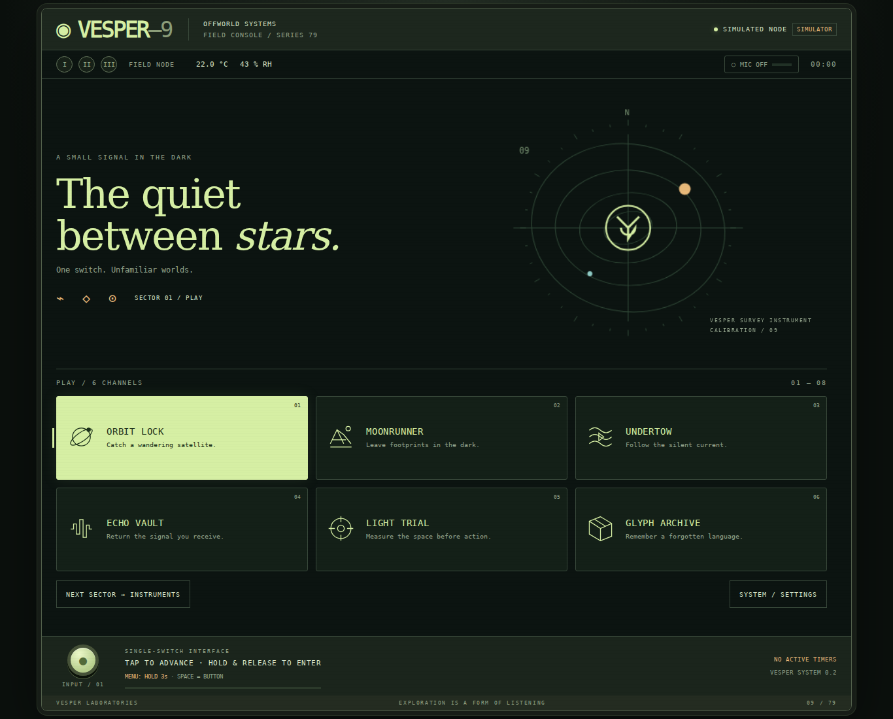

# VESPER—9

**A small signal in the dark.**

Version **0.2.0** — the second implementation pass of a one-button game console for a Raspberry Pi 5 and an ESP32-S3 field node. Imagine a survey terminal built in 1979 by a civilization that took a slightly different route: phosphor green, warm amber, orbital instruments, unfamiliar glyphs, quiet synthesized tones.

See [what changed in 0.2.0](docs/RELEASE-NOTES.md) and [the remaining Pi qualification work](docs/NEXT-STEPS.md).

The project includes a custom 2D game engine, a dashboard, six original games, six instruments, the Pi service, ESP32 firmware, a browser simulator, installation tools, tests, and an expansion example. The engine runs original applications; it does not emulate another console or load commercial ROMs.



## Try it immediately

Open **`VESPER-9-Simulator.html`** in a desktop browser. It is self-contained and needs no installation or internet connection. Use **Space** or the circular on-screen button. Click a card for direct access.

| Gesture | Dashboard, instruments and menus | Inside a game |
| --- | --- | --- |
| Short press | Next item | The game's action |
| Hold about 0.65 s, then release | Select item | The game's held action |
| **Tap, tap, hold** (two quick taps, then press and hold for about a second) | System menu | System menu |
| Escape on the keyboard, or the PAUSE button | System menu / close menu | Pause menu |

Tap, tap, hold is the same in every game, instrument and on the dashboard. The two taps and the start of the hold reach a game as ordinary presses; when the menu opens, the game puts back anything they changed. Calibration sets how quick the taps must be (quick, standard, relaxed). A plain three-second hold also opens the menu from the dashboard, instruments and menus, silently.

The standalone file simulates the lights and environmental sensor. It does **not** access the ESP32 or perform speech recognition. Its scores and settings stay in that browser. The full Pi service supplies real hardware and local speech.

## Install on the Pi

Use Raspberry Pi OS **64-bit Desktop**, Python 3.10 or newer, Chromium, and the node's **COM** USB-C port. Keep this project folder intact.

```bash
cd vesper9
sudo apt update
sudo apt install python3-venv chromium
bash scripts/install-pi.sh
```

That installs the service and downloads the small English speech model. Use `--no-speech` to omit speech. See [the installation guide](docs/INSTALL.md) for serial permissions, the first firmware install, rollback, and troubleshooting.

The unchanged 0.1.0 firmware uses protocol v1 and the provided pin map. If your node already runs it, an app update does not require reflashing. To replace the node's current firmware, use the prebuilt installer; it **backs up the existing 16 MB flash before writing**:

```bash
ls -l /dev/serial/by-id/
bash scripts/flash-prebuilt.sh /dev/serial/by-id/YOUR_COM_PORT
.venv/bin/python -m vesper.server --port /dev/serial/by-id/YOUR_COM_PORT
```

Open **http://localhost:8799** on the Pi. Begin with **Instruments → Node Scope** to exercise the button, each light, sensor readings, and microphone. No wiring changes are required by this design.

For desktop simulation with the full service:

```bash
bash scripts/run-simulator.sh
```

For automatic service startup and a full-screen kiosk at desktop login:

```bash
.venv/bin/python scripts/install-service.py --port /dev/serial/by-id/YOUR_COM_PORT --kiosk
```

## The cartridges

| Game | What you do |
| --- | --- |
| **Orbit Lock** | Catch a satellite as it crosses an increasingly narrow amber gate. |
| **Moonrunner** | Fly a survey sled over the moon's hills before night falls: hold to dive down a slope, let go to fly off the crest, land along a downslope for a perfect slide; six zones, survey orders and unlocks. |
| **Undertow** | Hold to rise, release to sink, and fly through submerged ruins. |
| **Echo Vault** | Repeat growing sequences of short and long pulses, accompanied by the three lights. |
| **Light Trial** | React to the middle physical light; the ESP32 timestamps the cue and button edge on the same clock. |
| **Glyph Archive** | Remember an inscription, then reconstruct it with an automatically scanning cursor. |

| Instrument | What it provides |
| --- | --- |
| **Signal School** | Guided keying, listening/scanned answers, adaptive review, and progress saved after each answer. |
| **Chronometer** | Custom durations/labels, saved presets, eight persistent timers, pause/resume and background alerts. |
| **Field Notes** | Local dictation, older-note/text paging, selected-session export and explicit start/stop. |
| **Atmosphere** | Freshness-aware SHT3x readings, 24-hour charts and 30-day retention. |
| **Node Scope** | Button state, individual RGB checks, mic meter, transport counters, audio test. |
| **Calibration** | Sound, texture, Morse/scan speed, menu-gesture timing and selection hold. Under SYSTEM TOOLS in the system menu, with Node Scope and Telemetry. |

The dashboard shows the sectors named in `vesper/catalog.json` (at most six cards each): the fourteen games first, then the instruments. Calibration, Node Scope and Telemetry are under SYSTEM TOOLS in the system menu; Ephemeris is retired from the dashboard. [Game and operator notes](docs/OPERATOR.md) explain the controls and scoring.

## Voice and sound

Microphone modes are **Off**, **Voice commands**, and **Transcription**. The system starts muted. Enable a mode from the microphone menu using the button.

In command mode, say “computer home,” “computer open morse,” or “computer timer five minutes.” The prefix is part of an exact command grammar, not a separate always-on wake-word service. Dictation never executes commands. When enabled, dictation can continue while you use other apps; the microphone indicator remains visible. Mute through the system menu or stop in Field Notes.

Recognition uses a local Vosk model. No cloud account, API key, or ongoing network connection is required after installation. Only transcript text is stored; audio is not recorded to disk. Optional sound comes from the Pi's configured HDMI/USB audio output. The node itself has no speaker in the supplied hardware list.

## How it is built

- **Browser engine:** dependency-free ES modules, a 960 × 540 Canvas 2D stage, fixed 60 Hz simulation, collision helpers, procedural visuals, synthesized audio, app lifecycle, and a shared input router.
- **Pi service:** Python / aiohttp, WebSocket events, serial transport, local speech, SQLite storage, background timers, and reconnect handling.
- **ESP32 node:** ESP-IDF C firmware, button debounce, nine independent PWM channels, I²S audio, I²C sensor, framed serial protocol, node-clock reaction trials, and a host watchdog.
- **Simulator:** the same apps and rendering code with either a Python simulated node or an in-browser device adapter.

[Engine and extension guide](docs/ENGINE.md) · [Protocol](docs/PROTOCOL.md) · [Hardware profile](docs/HARDWARE.md) · [Design system](docs/DESIGN.md)

## Verification and limits

This pass reran the Python and JavaScript regressions, C protocol check, all-app browser workflows, added-cartridge example, and real recorded-audio Vosk inference. See the versioned validation report for exact results. The ESP32-S3 firmware builds successfully with ESP-IDF **v5.4.2**; prebuilt images and checksums are included.

**This release has not been flashed onto or benchmarked on your physical Pi and node.** Real USB reliability, microphone level, PWM output, sensor timing, and Pi frame rate still need the short bring-up procedure in the guide. Speech accuracy depends on acoustics and the model. Light Trial measures software-scheduled light activation, not a laboratory-calibrated optical response.

[Current validation results](docs/VALIDATION.md) · [Reproduction commands](docs/TESTING.md) · [Third-party notices](THIRD_PARTY.md)

The project is designed for editable installation from this folder. It is not distributed as a standalone Python wheel; the `web/` and model directories are part of the appliance layout.

Original source and procedural artwork: MIT license. See `LICENSE`.
