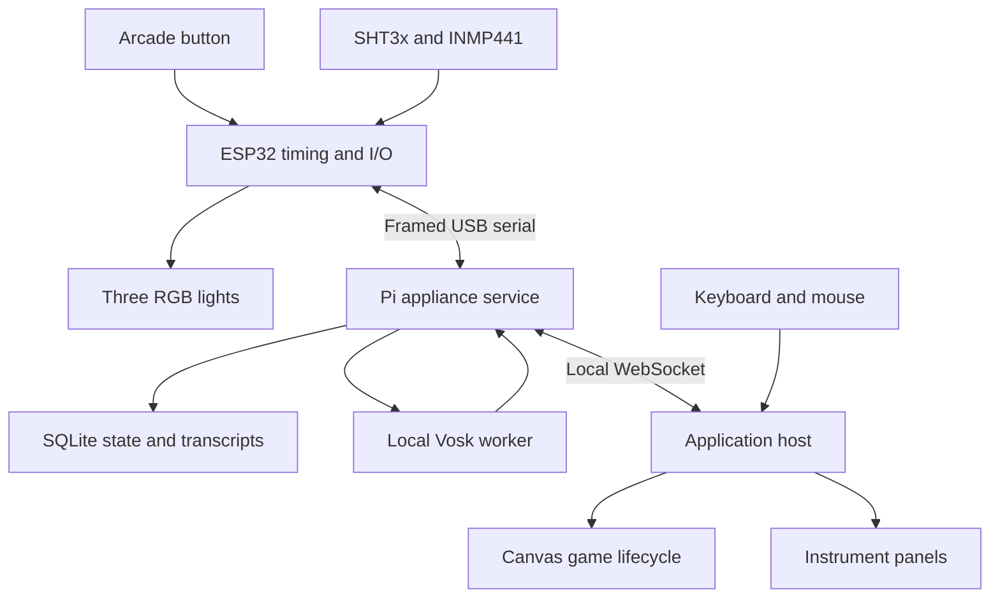

# Engine and expansion guide

VESPER's engine is a small application host specialized for this instrument: one switch, three RGB lights, voice, environment readings, and a display. Its scope is 2D games and utilities. It provides a real shared runtime rather than a collection of unrelated scripts; it does not attempt a Unity-style editor, ROM emulation, a 3D renderer, or arbitrary third-party plugin isolation.

## Ownership and topology



The ESP32 owns physical sampling, debounce, PWM, and precise reaction timestamps. The Pi service owns serial communication, microphone mode, recognition, background timers, and durable state. The browser host owns navigation, rendering, game simulation, and synthesized sound. A game does not open a serial port or construct GPIO commands.

`web/main.js` contains the host. `web/engine/` contains reusable adapters and helpers. `vesper/catalog.json` is the authoritative declarative cartridge catalog; `scripts/build-catalog.py` generates `web/apps/catalog.js`. `web/apps/registry.js` maps catalog factory names to trusted JS classes. Node firmware remains unchanged when adding ordinary games.

## Lifecycle

A registered factory receives an app context and returns an object with any of these methods:

| Member | Meaning |
| --- | --- |
| `navigation = true` | A menu-driven HTML instrument. Omit for a Canvas game. |
| `down(event)` | Immediate accepted switch-down in a game. |
| `up(event)` | Switch release; includes `durationMs`. |
| `cancel()` | Clear any held input or sidetone after focus changes. |
| `update(dt)` | Fixed simulation step, `dt = 1 / 60`, games only. |
| `draw(g)` | Draw into the 960 × 540 Canvas 2D context. |
| `event(event)` | Sensor, speech, cue, scores, timer, and device events. |
| `pause()` / `resume()` | Global menu opened/closed. |
| `dispose()` | Release owned activity on exit. Save accepted learning outcomes during play, not only here. |
| `menuActions()` | Optional additional system-menu choices, such as learning modes or replay. |
| `tick()` | Optional one-second utility refresh; keep it short. |

Rendering uses `requestAnimationFrame`; updates use an accumulator with a maximum of six catch-up steps per frame. A delayed frame cannot create an unbounded physics catch-up loop. This targets 60 simulation steps per second; achieved rendering speed depends on the Pi/browser/display.

Pause freezes game simulation. Timers and explicitly enabled dictation remain Pi services, so they continue. Losing the browser's visible page pauses the active app; a broken node link also pauses and cancels held input. Microphone capture stops on controlling-tab disconnect or host watchdog expiry.

Canvas state is normalized at the start of each frame, but app drawing should still pair `save()`/`restore()` and restore alpha. Keep layout in the logical 960 × 540 coordinate space; CSS scales it to the screen.

## Input contract

The input router records the source, current navigation epoch, and mode at press-down. A release from another source is ignored. A release after an app change cannot accidentally select an item in the new app.

Menus use short-release to advance and hold-release to select. The default selection threshold is 650 ms. Games receive edges immediately and interpret duration themselves. Four quick short clicks normally open the system menu; triple-click and legacy hold are settings. Ordinary game holds remain available. Morse and Echo declare `escape: "hold"` to protect their pulse input. Menus always retain the three-second hold escape. Games must tolerate `cancel()` after earlier gesture inputs have already reached them; the terminal release is consumed. Source, epoch and connection-generation changes discard partial sequences. Node timestamps determine click spacing even when USB delivers events in a burst.

Button events contain `source` (`node`, `simulator`, or `keyboard`) and `at_us`. ESP32 times are monotonic microseconds since node boot. They are not comparable to Pi, browser, or Unix clocks. Light Trial compares cue and button events only within the same clock domain. A keyboard action in hardware mode uses approximate screen timing.

The keyboard and mouse are additional ways to operate the same navigation. `Space` is the virtual switch; `Escape` opens/closes the menu; right/down arrows advance menus. All actual menu actions are native HTML buttons, so direct clicking and ordinary keyboard focus also work.

## App context

| Context member | Purpose |
| --- | --- |
| `rng` | Seedable PRNG helper: `next()`, `range(a,b)`, `int(a,b)`. |
| `settings()` / `state()` | Current settings and console state. Treat returned state as read-only. |
| `simulated()` | Whether this is a simulator. |
| `alive()` | Whether this app instance is still mounted; check after async work. |
| `hud([[label,value], ...])` | Small persistent game readouts. |
| `hint(text)` | App-specific status/readout text above the control deck. |
| `controls(text)` | Update the persistent control deck when a cartridge changes mode. |
| `tone(hz, seconds, waveform)` | Short synthesized tone. |
| `synth.startTone(hz)` / `stopTone()` | Morse or held-input sidetone. |
| `leds([r,g,b,r,g,b,r,g,b])` | Desired light values, 0–255, left to right. Host coalesces changes. |
| `pattern(steps)` | Node-timed finite light sequence. Each step has `ms` and nine `values`. |
| `best(metric?)` / `score(number, metric?)` | Persisted high score; higher is better. Reaction uses physical/keyboard/simulator classes; Glyph uses scan interval classes. |
| `progress()` / `saveProgress(object)` | This app's small JSON progress object, at most 8 KiB. |
| `content(html)` | Set instrument-panel markup; escape variable/user text. |
| `actions([{label, run}, ...])` | Render actions and make them navigable with the switch. |
| `command(name, data)` | Validated service command; returns a Promise. |
| `get(path)` | JSON GET under `/api/`, for history or saved notes. |
| `setMic(mode)` | Central microphone mode transition. |
| `home()` / `help(text)` / `toast(text)` | Shared navigation and feedback. |

The shared `LightDirector` serializes commands and invalidates generations/cache on owner changes. Exit explicitly cancels effects and writes zero; a cached zero cannot skip cleanup after a physical pattern. Retired app contexts ignore mutating calls. Cleanup hooks are contained, while intentional service-owned timers/dictation persist. Normal `leds()` calls are coalesced to at most about 17 updates/s; use node-timed patterns for scheduled light sequences. Reaction and pattern commands temporarily transfer light control to the node. Timers do not take the lights during a game.

Lamp ownership is explicit. `LightDirector.owner` is `host` until an app calls `ctx.leds`, `ctx.pattern` or a reaction command (or `cancel`), then `app`; `release()` (leaving an app, opening a menu) writes zero and returns it to `host`. While the owner is `app`, `setHost()` is ignored, so host effects cannot leak into a game. While it is `host`, `Vesper.driveHostLamps()` feeds `HostLamps` in `web/engine/ambient.js` the scene (dashboard, menu, instrument, game), the focused item's index and count, button hold progress, the quick-click count, recent acknowledgements, the nearest running timer's remaining seconds and the node's confirmed microphone capture, and writes the nine values it returns. `ambient.js` is pure: it needs only state and a time. The `lampLevel` setting (`full` 1, `medium` 0.5, `low` 0.2, `off` 0) is applied by the director to plain `leds` values and to the colours of `pattern` steps (a lit channel never rounds to zero while the level is above zero); a reaction cue has fixed colours in the service and is passed through unscaled. The microphone lamp is composed last, scaled by the level but never below a floor. The `light_effect` event (timer completion, `durationMs`) suspends writes and keeps the ambient layer quiet for the effect plus 1.5 s, then fades it back in over 2 s.

Apps are trusted source files shipped with the project. This is not a sandbox for downloaded, untrusted JavaScript. There is one foreground app and one controlling browser tab.

## Add a cartridge

An implemented expansion example is provided in `examples/pulse-app.js`. To install it:

1. Copy `examples/pulse-app.js` to `web/apps/pulse-app.js`.
2. Add `import { PulseGarden } from "./pulse-app.js";` and `PulseGarden` to `FACTORIES` in `web/apps/registry.js`.
3. Add a declarative entry to the `apps` array in `vesper/catalog.json`:

```json
{
  "id": "garden", "name": "PULSE GARDEN", "subtitle": "Plant signals in the dark.",
  "description": "An ambient instrument that turns each press into an expanding signal.",
  "controls": "PRESS TO PLANT", "category": "EXPANSION / AMBIENT", "glyph": 4,
  "factory": "PulseGarden", "escape": "adaptive", "voice": ["garden"],
  "capabilities": ["button", "lights", "audio", "progress"]
}
```

4. Run `python3 scripts/build-demo.py`. It regenerates the catalog and standalone simulator. `python3 scripts/build-catalog.py --check` detects a stale browser catalog.
5. Restart the service and reload the browser. The catalog automatically supplies backend validation and the `computer open garden` alias. A third dashboard sector appears.

The example persists its signal count. `tests/extension-smoke.cjs` installs it in an isolated copy and checks button launch, state, exit, alias registration, the service and the generated HTML. Capability metadata documents intent; it does not sandbox trusted JavaScript.

The included bundler supports the project's named imports/exports. It is intentionally small and does not support arbitrary npm modules, dynamic imports, or re-export chains. The full browser app uses normal ES modules and requires no bundling.

## Reusable game primitives

- `math.js`: deterministic random numbers, clamp/lerp, angle wrapping, axis-aligned rectangle collision, text escaping, duration formatting.
- `draw.js`: phosphor palette, text, lines, circles, diamonds, procedural glyphs, a star field, grids, and title/result banners.
- `audio.js`: oscillator envelopes, short tones, sustained sidetone, chimes; optional simulator microphone resampling.
- `input.js`: source ownership, gestures, release suppression, global escape, cancellation.
- `bridge.js`: local WebSocket transport, request correlation, reconnect, microphone PCM forwarding in server simulation.
- `demo.js`: standalone node, timers, fake environment readings, and browser-local persistence.

Audio inference is bounded and runs in a worker thread. The I/O event loop remains available for serial and WebSocket messages. Raw audio travels from the node to the Pi worker, not to every browser client.

## Persistence and recovery

SQLite uses WAL mode. High scores, settings, timers, Morse per-answer progress, transcript sessions/lines, and sensor history have separate storage concerns. Timer deadlines are absolute OS times, allowing restart recovery. Sensor samples are stored approximately every 30 seconds, retained for 30 days, and plotted as five-minute averages over the latest 24 hours.

Serial frames have checksums and bounded lengths. On reconnect, the Pi sends mute, cancel, and lights-off before resuming normal operation. Current button status reconciles an idle switch; held-across-reset input waits for release. Node resets advance a host-side generation so reaction results cannot mix boots. The node watches for host traffic and stops acquisition after three seconds without it. App exceptions open a recovery menu offering restart or dashboard. Recognition/callback failures stop the worker, report an error and trigger a separate microphone shutdown path. A later explicit mode request can create a new worker; there is no automatic capture retry.

## Where to grow next

The existing interfaces leave room for application-specific difficulty settings, more training exercises, procedural campaign maps, and alternate speech models. They do not yet provide save states for arbitrary game runs, a cartridge package installer, network multiplayer, or a graphical level editor. Add these only when a particular game needs them; the current source provides the common foundations.
